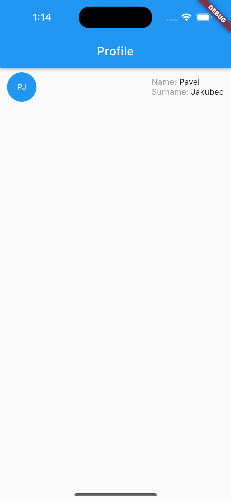
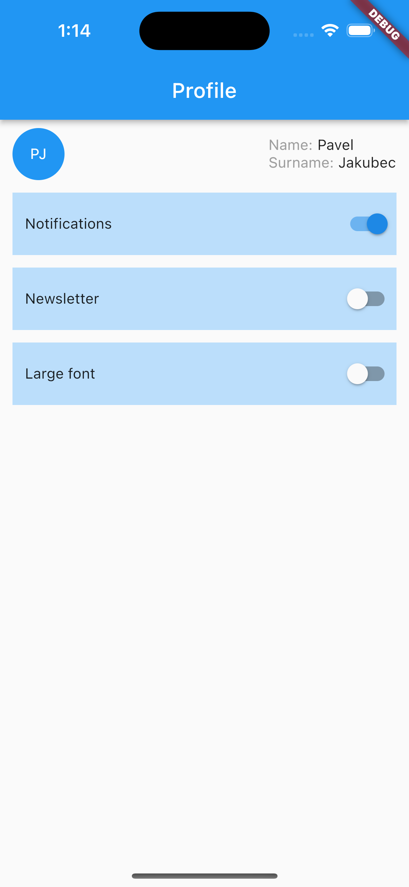
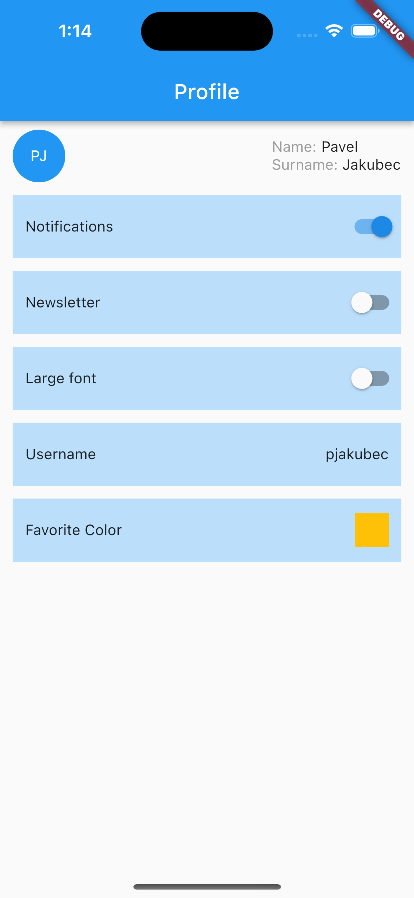

# Exercise 2
Implement a single-page app with a static UI.

As always, do not duplicate code. Instead, identify repetitive patterns and turn them into reusable code. See the bottom
of this file for widgets that may be useful throughout this exercise.

## Starting code
The provided app code includes the basic structure needed to run a Flutter app as demonstrated in lesson 1: `main` 
function and `UserProfileApp` widget that wraps the entire application in the `MaterialApp` widget.

Additionally, stateless widgets `ProfilePage` and `Avatar` are included as implemented during today's demo.

## Task 1
Add the name and surname of the user to the `ProfilePage` widget. Both of these should be labeled:
- Name: _name_
- Surname: _surname_

Labels' text will be grey, and name and surname black.

Labeled name and surname are to appear above each other, right of the `Avatar` on `ProfilePage` approximately as shown below:
.

### Notes
- Notice that the page content is not touching the screen edges in the example image ;)
- Do not waste too much time on precise alignment

## Task 2
Add three settings cards with switch widgets for different UI settings, approximately as shown in the sample below. 
The cards will be separated by (e.g. 12 points high) gaps. Set background color of the cards (e.g. to `Colors.blue[100]`). 
For now, turning the switches on/off will not be possible. Upon opening the app, the *"Notifications"* switch will be on, 
the others will be off.

## Bonus 1
Create model class `User` that will encapsulate name and surname of a person. Add a property `currentUser` to widget 
`ProfilePage`, for it to be able to display different users. Do not forget to modify class `Avatar` to also work with 
instances of `User`.

Note: There will be no visual change to the app after Bonus 1.
 
## Bonus 2
Add a new setting card with the label *"Favorite color"* and a preview of user's favorite color (for now, hardcoded 
`Colors.amber`) instead of a switch on the right. Also, add a settings card with label *"Username"* and hardcoded text 
e.g. *"pjakubec"* on the right. Think about how to minimize code duplication between all the settings cards considering 
different widgets in the right area. Some Flutter standard widgets that you have already used today may be a good 
inspiration ;)

Here is an example of the expected result:

## Bonus 3
Ensure that the app scrolls vertically in case it is run on a device with a very small screen.

## Bonus 4
Move all hardcoded settings values like default state of the switches and username to class `User`. 

## Widgets that may come in handy ;)
- `Text`, `Switch`, `Container`, `Column`, `Padding`, `SingleChildScrollView`, `Row`,  `SizedBox`